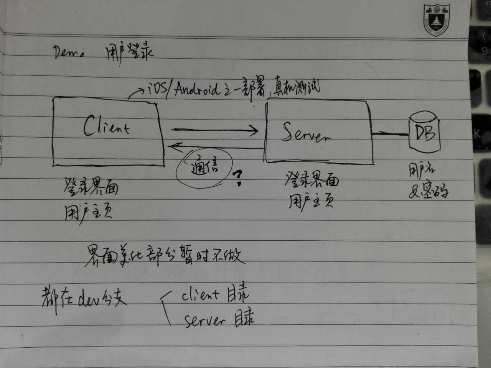

# 2. 概述

软件使用C/S架构，分为client端和server端。由于目前项目还在刚起步阶段，暂时准备在做出一个demo之后再考虑更细致的架构。目前计划做一个用户登录的demo：

client端要实现登录界面和用户主页，server端要连接上mongoDB数据库，数据库中存有用户名和密码信息。server端提供一个地址，接受HTTP请求；client端发送POST请求，参数为用户名和密码，server端收到请求后，访问数据库，判断用户名和密码是否正确，返回结果的JSON。client根据JSON的内容判断用户登录是否成功。



# 3. 接口设计

## 3.3 内部接口

内部接口规定了服务器和客户端之间的交互协议。

#### RESTful接口

服务器接收HTTP请求对情报信息、指挥命令、文档列表、用户信息进行操作。如无特殊说明，下面接口中request和response的格式都为JSON。GET方法返回的状态码为200，POST、PUT、返回的状态码为201，DELETE返回的状态码为204；出错情况下返回的状态码会特殊说明。

根据RESTful接口的语义，GET、PUT、DELETE方法都是幂等的，即多次发送GET、PUT、DELETE方法的请求，作用应该和发送一次的效果相同。POST方法不是幂等的。下面对于GET、PUT、DELETE方法不再做特殊说明，认为是幂等的。

情报信息：

| HTTP方法 | 路径 | 功能 | 权限 |
|---|---|---|---|
| GET | /information | 获得情报列表 |  所有用户 | 
| GET | /information?publisher=_userid_ | 按发布用户ID搜索情报 | 管理员 |
| GET | /information?keyword=_keyword_ | 按关键字搜索情报 | 管理员 |
| GET | /information/_info\_id_ | 获得情报详情 | 所有用户 |
| GET | /information/_info\_id_/replications | 获得情报回复列表 | 所有用户 | 
| POST | /information | 发送情报 | 所有用户 | 
| POST | /information/_info\_id_ | 在情报中插入图片 | 情报所属用户 |
| POST | /information/_info\_id_/replications | 添加回复 | 所有用户 | 
| DELETE | /information/_info\_id_ | 删除情报 | 情报所属用户、管理员 |

情报为一个Information对象，包含`id`, `publisher`, `text`, `images`, `urgent`, `replications`六个属性，分别代表情报ID、情报发布者（ID）、情报文本、图片列表、是否紧急、回复列表。

回复为一个Replication对象，包含`publisher`, `content`两个属性，分别代表回复发布者（ID）、回复内容。

1. GET /information 获得情报列表。服务器返回Information对象的数组，返回200状态码。不带查询参数时，返回所有情报的列表；带有查询参数时，返回情报列表进行筛选后的结果。如果有多个查询参数，则进行多重筛选。如果查询参数名称不正确，结果是未定义的。

2. GET /information/_info\_id_ 获得ID为_info\_id_的情报信息。服务器返回一个Info对象，返回200状态码。如果ID为_info\_id_的情报不存在，返回404状态码。

3. POST /information 新增一个情报。用户请求发送一个Information对象，服务器返回新增的Information对象，返回201状态码。多次发送该请求时，服务器每次会尝试新增一个情报。如果情报ID已存在，服务器返回400状态码。

指挥命令：

| HTTP方法 | 路径 | 功能 | 权限 |
|---|---|---|---|
| GET | /commands | 查看命令列表 | 管理员 |
| GET | /commands?receiver=_userid_ | 查看某个用户收到的命令 | 用户自己 | 
| POST | /commands | 发送命令 | 所有用户 | 

指挥命令为一个Command对象，包含`receiver`, `sender`, `content`三个属性，分别代表命令的接收者（ID）、发送者（ID）、内容。

1. GET /commands/ 获得命令列表。服务器返回Command对象的数组，返回200状态码。不带查询参数时，返回所有命令的列表；带有查询参数receiver时，返回按发送者进行筛选后的命令列表。如果查询参数名称不正确，结果是未定义的。

2. POST /commands 新增一个命令。用户请求发送一个Command对象，服务器返回新增的Command对象，返回201状态码。多次发送该请求时，服务器每次会尝试新增一个命令。如果Command对象的三个属性不完整，服务器返回400状态码。

文档列表：

| HTTP方法 | 路径 | 功能 | 权限 |
|---|---|---|---|
| GET | /documents/_class_/_subclass_/_doc\_name_ | 获得文档 | 所有用户、管理员 | 
| POST | /documents/_class_/_subclass_/_doc\_name_ | 新建文档 | 管理员 |
| PUT | /documents/_class_/_subclass_/_doc\_name_ | 更新文档 | 管理员 |
| DELETE | /documents/_class_/_subclass_/_doc\_name_ | 删除文档 | 管理员 |

用户：

| HTTP方法 | 路径 | 功能 | 权限 |
|---|---|---|---|
| GET | /users | 获得用户列表 | 所有用户 |
| GET | /users?region=_region_ | 按区域搜索用户 | 所有用户 |
| GET | /users?level=_level_ | 按级别搜索用户 | 所有用户 |
| GET | /users?name=_name_ | 按姓名搜索用户 | 所有用户 | 
| GET | /users?id=_userid_ | 按ID搜索用户 | 管理员 |
| GET | /users/_userid_ | 获得用户信息 | 所有用户 |
| POST | /users | 新增用户 | 管理员 | 
| PUT | /users/_userid_ | 修改用户信息 | 管理员 | 
| PATCH | /users/_userid_ | 部分更新用户信息 | 管理员 | 
| DELETE | /users/_userid_ | 删除用户 | 管理员 | 

用户数据为一个User对象，含有`id`,`name`,`level`,`region`,`description`,`phone`六个属性，分别代表用户的ID、姓名、级别、区域、描述、电话。

1. GET /users 获得用户列表。服务器返回User对象的数组，返回200状态码。不带查询参数时，返回所有用户的列表；带有查询参数时，返回用户列表进行筛选后的结果。如果有多个查询参数，则进行多重筛选。如果查询参数名称不正确，结果是未定义的。

2. GET /users/_userid_ 获得ID为_userid_的用户的信息。服务器返回一个User对象，返回200状态码。如果ID为_userid_的用户不存在，返回404状态码。

3. POST /users 新增一个用户。用户请求发送一个User对象，服务器返回新增的User对象，返回201状态码。多次发送该请求时，服务器每次会尝试新增一个用户。如果User对象的六个属性不完整，或用户ID已存在，则服务器返回400状态码。

4. PUT /users/_userid_ 修改ID为_userid_的用户的信息。用户请求发送一个User对象，服务器将ID为_userid_的用户信息替换为User中的用户信息，返回修改后的User对象，返回201状态码。如果ID为_userid_的用户不存在，返回404状态码。如果User对象的ID属性和_userid_不等，或User对象的六个属性不完整，服务器返回400状态码。

5. PATCH /users/_userid_ 部分更新ID为_userid_的用户的信息。用户请求发送一个（不一定完整的）User对象，服务器将ID为_userid_的用户信息根据User中的属性进行部分更新，返回更新后的User对象，返回201状态码。如果ID为_userid_的用户不存在，返回404状态码。User对象一定要含有ID属性，除ID外的五个属性可包含一个或多个。如果User对象的ID属性和_userid_不等，或User对象的属性有错误，返回400状态码。

6. DELETE /users/_userid_ 删除ID为_userid_的用户。服务器返回一个空对象，返回204状态码，即使ID为_userid_的用户不存在。

以上的HTTP请求，如果服务器在处理请求时发生了内部错误，返回500状态码。

密码：

| HTTP方法 | 路径 | 功能 | 权限 |
|---|---|---|---|
| PATCH | /shadows/_userid_ | 修改密码 | 用户自己 | 

区域：

| HTTP方法 | 路径 | 功能 | 权限 |
|---|---|---|---|
| GET | /regions | 获得区域列表 | 所有用户 |
| POST | /regions | 添加区域 | 管理员 |
| DELETE | /regions/_region\_id_ | 删除区域 | 管理员 |


#### 检查用户名和密码

客户端向服务器URL `/user/check-password`发送HTTP请求，参数为`username`和`password`，例如：

```
/user/check-password?username=dog&password=123456
```

服务器返回JSON格式的数据，包含三个属性：status, errorcode和error。

status, errorcode和error的各项取值及含义：

| status取值 | errorcode取值 | error取值 | 含义 |
|----------|----------|----------|----------| 
| pass | 0 | no error | 无错误 |
| fail | 1 | empty username | 空用户名 | 
| fail | 2 | empty password | 空密码 |
| fail | 3 | user does not exist | 用户名不存在 | 
| fail | 4 | wrong password | 密码错误 |
| fail | 5 | database error | 数据库错误 |


